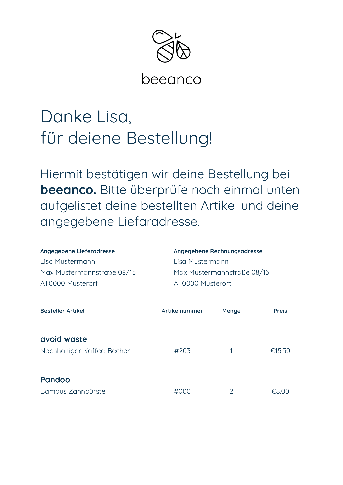

# Task for backend developers
The objective is to develop a node.js microservice that renders invoices to PDFs. It should expose a REST API that handles incoming JSON requests and renders the invoice.

## Running the service
The service can be started with `npm run start` and it listens on port 3000

## Testing the service
The service can be tested with `npm run test`.

It is currently set up for unix systems and runs the command (Will not work on Windows machine):

```sh
curl -X POST -H "Content-Type: application/json" -d @./test/fixtures/sample-request.json http://localhost:3000 --output test/results/sample-request.pdf
```

The system was created and tested on a Windows machine and it is provided with a very similar Windows working shell script:

```sh
curl.exe -X POST -H "Content-Type: application/json" -d "@./test/fixtures/sample-request.json" http://localhost:3000 --output test/results/sample-request.pdf
```

It can be tested using the shell script by replacing the `test` in `package.json` with:

```json
"test": "test.sh"
```

The output as tested on a Windows machine will result in the following.

